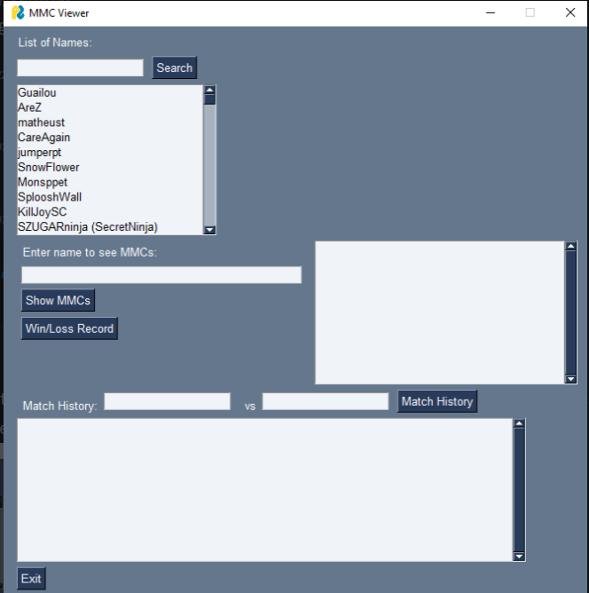

# MMC-Stats

## Library Reqiurements

### Pychallonge
In order to use the challonge API to pull the data from any MMC tournament, you need to install the `Pychallonge` library.

For the stable version install using pip:
```
pip install pychallonge
```

To see examples of the usage and view the code, visit the github repo [Pychallonge](https://github.com/ZEDGR/pychallonge)

### pandas 
Pandas is used in this repo. To install pandas using pip:
```
pip install pandas
```

For the documentation go to the pandas [website](https://pandas.pydata.org/docs/)

### PySimpleGUI
A simple GUI for python, you will need to make an account. That will be prompted upon first running the library. You will first need to download the library using pip:
```
pip install PySimpleGUI
```
An example of what it will look like when you have signed in is:


***NOTE: This is currently in development and will cause errors if you attempt to use it right now***

### Other Libraries
All other libraries used are standard python libraries and do not require installation. The libraries used are:
- os
- json
- sqlite
- datetime
- typing

## Files

### main.py
This is the file used to create the database from scratch.
To run navigate to the `MMC-STATS` folder in the command line and run:
- For Windows
```
python main.py
```
- For Mac and Linux
```
python3 main.py
```

### addMMC.py
This is the file used to add data from a new, single tournament. 
It will both pull the data from the finished tournament, add it to the MMC folder, and then add the data to mmc.db.
If it encounters challonge usernames it hasn't seen before, it will print them out and stop the script.
Before you can continue you will need to add those usernames to `Names.csv` with the appropriate information.
You can just open up `Names.csv` in excel to easily add the info and then continue.
Run the program again and it should now run to completion.
Before running the program, open up the file and change the variable `mmc` on line 9 to whatever edition of MMC you are wanting to add.
Then in the command line run:
- For Windows
```
python addMMC.py
```
- For Mac and Linux
```
python3 main.py
```

### mmc.db
This is the sqlite database file that contains all the organized data.

### Names.csv
This is a csv file that contains all the challonge usernames ever encountered and the person they are connected to, along with the race, country, team, and offrace of that player (if known).
It can be opened and edited using excel.
It used utf-16 encoding and for some magical reason that I did not make happen uses the delimeter `\t` (tab).
When adding someone who already appears higher up in the file, you only need to include their challonge username and normal name, not any of the other details.
That is only included when someone appears for the first time in the file.

### testcases.ipynb
This is a jupyter notebook file used to do tests of a variety of sorts.
It is mainly a testing ground for designing stats queries.
A few different queries already exist, with more to follow.
It can be ran by going into the file and using it as you would any jupyter notebook file.
